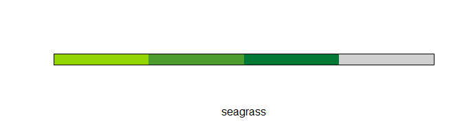
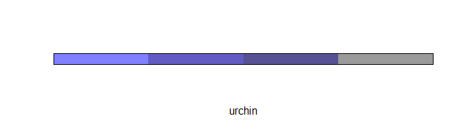
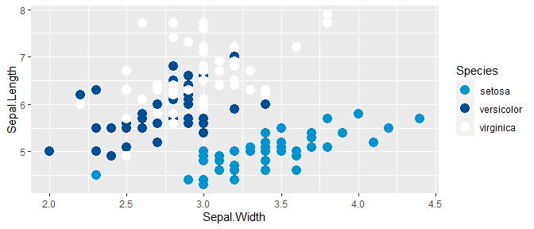
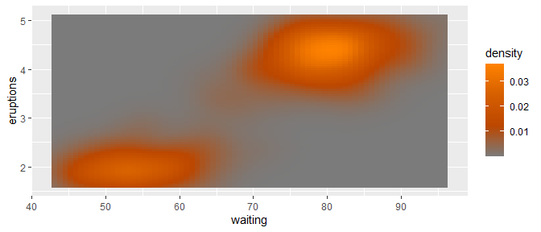

<!-- README.md is generated from README.Rmd. Please edit that file -->

# nmfspalette

an R color palette for `ggplot2` using NOAA Fisheries official colors

-----

This implements these
[steps](https://drsimonj.svbtle.com/creating-corporate-colour-palettes-for-ggplot2)
to create a `ggplot2` compatible palette according to NOAA Fisheries
branding.

## Installation

To install from Github use the following:

``` r
remotes::install_github("nmfs-general-modeling-tools/nmfspalette")
library(nmfspalette)
```

## Usage

Extract an interpolated color palette from the default “oceans” palette.
You can change the number of colors (10 shown below).

``` r
nmfspalette::nmfs_palette("oceans")(10)
#>  [1] "#0093D0" "#007EC1" "#0069B2" "#0055A4" "#005097" "#004B8B" "#00467F"
#>  [8] "#5483A9" "#A9C1D4" "#FFFFFF"
```

## Palettes

To see the palettes, use the `display_nmfs_palette()` function.

### oceans

``` r
nmfspalette::display_nmfs_palette("oceans", 4)
```

<!-- -->

### waves

``` r
nmfspalette::display_nmfs_palette("waves", 4)
```

<!-- -->

### seagrass

``` r
nmfspalette::display_nmfs_palette("seagrass", 4)
```

<!-- -->

### urchin

``` r
nmfspalette::display_nmfs_palette("urchin", 4)
```

<!-- -->

### crustacean

``` r
nmfspalette::display_nmfs_palette("crustacean", 4)
```

<!-- -->

### coral

``` r
nmfspalette::display_nmfs_palette("coral", 4)
```

<!-- -->

### regional web (discrete)

``` r
nmfspalette::display_nmfs_palette("regional web", 6)
```

<!-- -->

### secondary (discrete)

``` r
nmfspalette::display_nmfs_palette("secondary", 4)
```

<!-- -->

## Examples

If no argument is given to `scale_color_nmfs()`, default “oceans” is
used

``` r
p <- ggplot(iris, aes(Sepal.Width, Sepal.Length, color = Species)) +
     geom_point(size = 4) +
     scale_color_nmfs()
p
```

<!-- -->

`scale_fill_nmfs` requires a named argument for now, this is an example
using the “crustacean” palette

``` r
ggplot(mpg, aes(manufacturer, fill = manufacturer)) +
    geom_bar() +
    theme(axis.text.x = element_text(angle = 45, hjust = 1)) +
    scale_fill_nmfs(palette = "crustacean")
```

<!-- -->

-----

## Disclaimer

“The United States Department of Commerce (DOC) GitHub project code is
provided on an ‘as is’ basis and the user assumes responsibility for its
use. DOC has relinquished control of the information and no longer has
responsibility to protect the integrity, confidentiality, or
availability of the information. Any claims against the Department of
Commerce stemming from the use of its GitHub project will be governed by
all applicable Federal law. Any reference to specific commercial
products, processes, or services by service mark, trademark,
manufacturer, or otherwise, does not constitute or imply their
endorsement, recommendation or favoring by the Department of Commerce.
The Department of Commerce seal and logo, or the seal and logo of a DOC
bureau, shall not be used in any manner to imply endorsement of any
commercial product or activity by DOC or the United States Government.”

  - This project code is made available through GitHub but is managed by
    NOAA at
    <https://vlab.ncep.noaa.gov/redmine/projects/integrated-fisheries-toolbox/files>

-----
