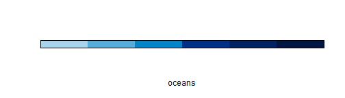
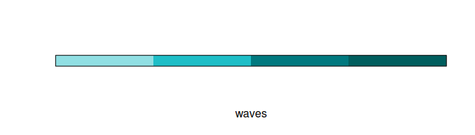
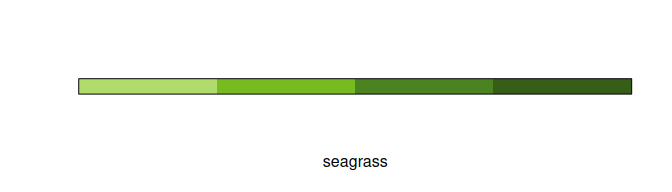
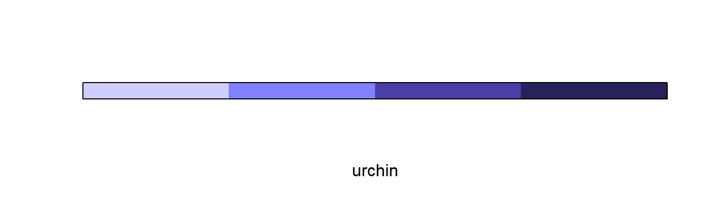
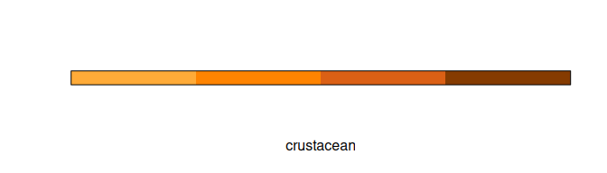
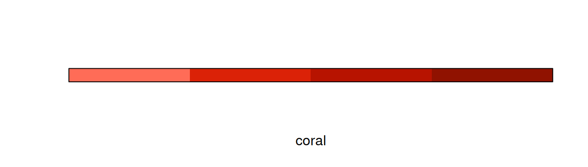
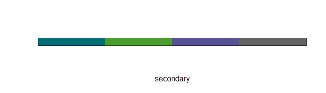
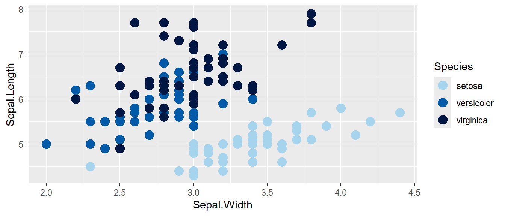
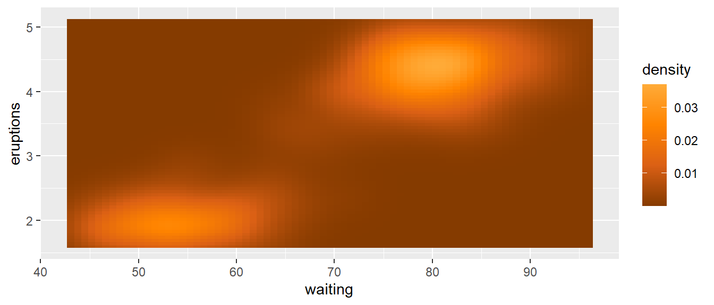

<!-- README.md is generated from README.Rmd. Please edit that file -->

# nmfspalette <a href={https:://nmfs-fish-tools.github.io/nmfspalette}>

an R color palette for `ggplot2` using NOAA Fisheries branding colors


-----

This implements these
[steps](https://drsimonj.svbtle.com/creating-corporate-colour-palettes-for-ggplot2)
to create a `ggplot2` compatible palette according to NOAA Fisheries
branding. The branding materials can be found [here](https://drive.google.com/drive/folders/1pcMRQHGdzX4NfsiDNTCYIBpRyP1-F57J) (NOAA internal only).

## Installation

To install from Github use the following:

``` r
remotes::install_github("nmfs-fish-tools/nmfspalette")
library(nmfspalette)
```

## Contributing

We welcome contributions to `nmfspalette`. You are welcome to make any
changes you would like on a fork and submit a pull request. For more
substantial changes or to create a branch, please contact
<christine.stawitz@noaa.gov> (NOAA Affiliates only). We ask that all
contributors adhere to The NOAA Fisheries Integrated Toolbox [code of
conduct](https://github.com/nmfs-fish-tools/Resources/blob/master/CONTRIBUTING.md).

## Usage

To learn how to use `nmfspalette`, please check out the interactive
`learnr` tutorial [here](https://cstawitz.shinyapps.io/colors/).

Extract an interpolated color palette from the default “oceans” palette.
You can change the number of colors (10 shown below).

``` r
nmfspalette::nmfs_palette("oceans")(10)
#>  [1] "#0093D0" "#0085C6" "#0077BC" "#0069B2" "#005BA8" "#00539F" "#005097"
#>  [8] "#004C8F" "#004987" "#00467F"
```

## Palettes

To see the palettes, use the `display_nmfs_palette()` function.

### oceans

``` r
nmfspalette::display_nmfs_palette("oceans", 4)
```

<!-- -->

### waves

``` r
nmfspalette::display_nmfs_palette("waves", 4)
```

<!-- -->

### seagrass

``` r
nmfspalette::display_nmfs_palette("seagrass", 4)
```

<!-- -->

### urchin

``` r
nmfspalette::display_nmfs_palette("urchin", 4)
```

<!-- -->

### crustacean

``` r
nmfspalette::display_nmfs_palette("crustacean", 4)
```

<!-- -->

### coral

``` r
nmfspalette::display_nmfs_palette("coral", 4)
```

<!-- -->

### regional web (discrete)

``` r
nmfspalette::display_nmfs_palette("regional web", 6)
```

<!-- -->

### secondary (discrete)

``` r
nmfspalette::display_nmfs_palette("secondary", 4)
```

<!-- -->

## Examples

In addition to `nmfs_palette` and `display_nmfs_palette` to get in-built
palettes, you can extract colors by name. Please see the NOAA Fisheries
Branding guide for color names, all spaces are replaced with underscores
in the color names.

``` r
nmfspalette::nmfs_cols("processblue")
#> processblue 
#>   "#0093D0"
```

To use the palettes with `ggplot2`, the `scale_color_nmfs()` and
`scale_fill_nmfs()` functions are provided. If no argument is given to
`scale_color_nmfs()`, a default (“oceans”) is used:

``` r
p <- ggplot(iris, aes(Sepal.Width, Sepal.Length, color = Species)) +
     geom_point(size = 4) +
     scale_color_nmfs()
p
```

<!-- -->

`scale_fill_nmfs` does not have a default and therefore requires a named
argument for now, this is an example using the “crustacean” palette

``` r
ggplot(faithfuld, aes(waiting, eruptions)) +
  geom_raster(aes(fill = density)) +
  scale_fill_nmfs(palette="crustacean", discrete=FALSE, reverse=TRUE)
```

<!-- -->

-----

## Disclaimer

“The United States Department of Commerce (DOC) GitHub project code is
provided on an ‘as is’ basis and the user assumes responsibility for its
use. DOC has relinquished control of the information and no longer has
responsibility to protect the integrity, confidentiality, or
availability of the information. Any claims against the Department of
Commerce stemming from the use of its GitHub project will be governed by
all applicable Federal law. Any reference to specific commercial
products, processes, or services by service mark, trademark,
manufacturer, or otherwise, does not constitute or imply their
endorsement, recommendation or favoring by the Department of Commerce.
The Department of Commerce seal and logo, or the seal and logo of a DOC
bureau, shall not be used in any manner to imply endorsement of any
commercial product or activity by DOC or the United States Government.”

  - This project code is made available through GitHub but is managed by
    NOAA at
    <https://vlab.ncep.noaa.gov/redmine/projects/integrated-fisheries-toolbox/files>

-----

<a href="https://www.fisheries.noaa.gov/">

[U.S. Department of Commerce](https://www.commerce.gov/) | [National
Oceanographic and Atmospheric Administration](https://www.noaa.gov) |
[NOAA Fisheries](https://www.fisheries.noaa.gov/)
