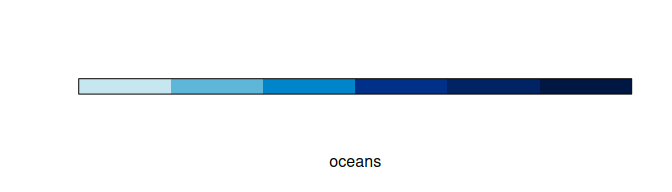
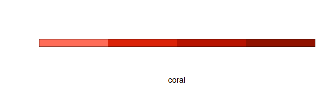
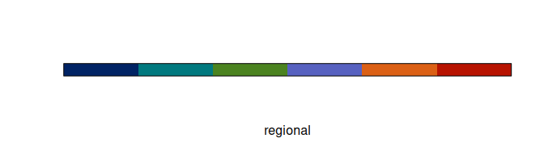
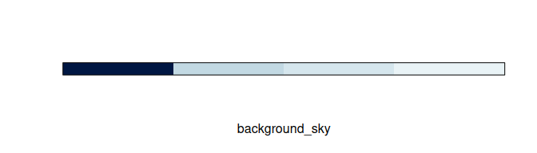
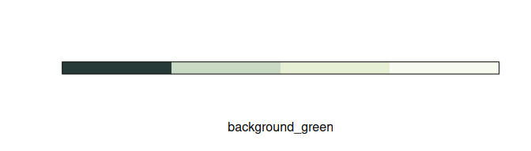
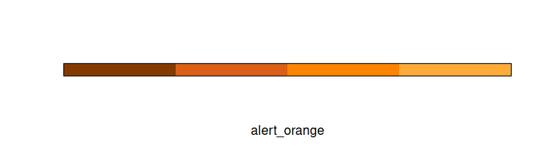

<!-- README.md is generated from README.Rmd. Please edit README.Rmd -->

# nmfspalette <a href={https:://nmfs-ost.github.io/nmfspalette}>

An R color palette for `{ggplot2}` using NOAA Fisheries branding colors

[](https://github.com/nmfs-ost/nmfspalette/actions/workflows/call-r-cmd-check.yml)

[](https://github.com/nmfs-ost/nmfspalette/tree/badges)

------------------------------------------------------------------------

`{nmfspalette}` implements these
[steps](https://drsimonj.svbtle.com/creating-corporate-colour-palettes-for-ggplot2)
to create a `{ggplot2}` compatible palette according to [NOAA Fisheries
branding](https://drive.google.com/file/d/1lXHmfGWCj6pI_Dr3C-Dwcnf1pXOIOztp/view?usp=sharing)
(NOAA internal only).

## Installation

To install from GitHub use the following:

``` r
remotes::install_github("nmfs-ost/nmfspalette")
#> 
#> ── R CMD build ─────────────────────────────────────────────────────────────────
#> * checking for file ‘/tmp/Rtmp3w1WfO/remotes1b2353225737/nmfs-ost-nmfspalette-8e0fa0e/DESCRIPTION’ ... OK
#> * preparing ‘nmfspalette’:
#> * checking DESCRIPTION meta-information ... OK
#> * checking for LF line-endings in source and make files and shell scripts
#> * checking for empty or unneeded directories
#> Omitted ‘LazyData’ from DESCRIPTION
#> * building ‘nmfspalette_3.0.0.000.tar.gz’
```

To load the package, use:

``` r
library(nmfspalette)
```

## Contributing

We welcome contributions to `{nmfspalette}`. You are welcome to make any
changes you would like on a fork and submit a pull request. For more
substantial changes or to create a branch, please contact
<sophie.breitbart@noaa.gov> (NOAA Affiliates only). We ask that all
contributors adhere to The NOAA Fisheries Integrated Toolbox [code of
conduct](https://github.com/nmfs-ost/Resources/blob/main/CONTRIBUTING.md).

## Usage

To learn how to use `nmfspalette`, please check out the [interactive
`learnr` tutorial](https://connect.fisheries.noaa.gov/colors/).

Extract an interpolated color palette from the default “oceans” palette.

You can change the number of colors (10 shown below).

``` r
nmfspalette::nmfs_palette("oceans")(10)
#>  [1] "#C6E6F0" "#8CCBE3" "#53B0D7" "#1F95CF" "#0072BB" "#004295" "#002B7B"
#>  [8] "#002467" "#001D55" "#001743"
```

## Palettes

To see the palettes, use the `display_nmfs_palette()` function.

### Main NOAA Fisheries palettes

These palettes contain 4 or 6 colors.

#### oceans

``` r
nmfspalette::display_nmfs_palette("oceans", 6)
```

<!-- -->

#### waves

``` r
nmfspalette::display_nmfs_palette("waves", 4)
```

<!-- -->

#### seagrass

``` r
nmfspalette::display_nmfs_palette("seagrass", 4)
```

<!-- -->

#### urchin

``` r
nmfspalette::display_nmfs_palette("urchin", 4)
```

<!-- -->

#### crustacean

``` r
nmfspalette::display_nmfs_palette("crustacean", 4)
```

<!-- -->

#### coral

``` r
nmfspalette::display_nmfs_palette("coral", 4)
```

<!-- -->

#### regional (discrete)

``` r
nmfspalette::display_nmfs_palette("regional", 6)
```

<!-- -->

### NOAA Fisheries complementary colors

These 5 palettes contain 4 complementary colors each and are identical
to the main NOAA Fisheries palettes, but some colors have different
names. Check out the [nmfs_cols.R
file](https://github.com/nmfs-ost/nmfspalette/blob/main/R/nmfs_cols.R)
for more information.

### NOAA Fisheries background & tint colors

These palettes contain 4 colors.

#### background sky

``` r
nmfspalette::display_nmfs_palette("background_sky", 4)
```

<!-- -->

#### background green

``` r
nmfspalette::display_nmfs_palette("background_green", 4)
```

<!-- -->

#### background gray

``` r
nmfspalette::display_nmfs_palette("background_gray", 4)
```

<!-- -->

### NOAA core colors (Fisheries version)

This palette contains 11 colors.

``` r
nmfspalette::display_nmfs_palette("core", 11)
```

<!-- -->

### NOAA alert colors

These palettes contain 4 colors.

#### alert red

``` r
nmfspalette::display_nmfs_palette("alert_red", 4)
```

<!-- -->

#### alert orange

``` r
nmfspalette::display_nmfs_palette("alert_orange", 4)
```

<!-- -->

#### alert yellow

``` r
nmfspalette::display_nmfs_palette("alert_yellow", 4)
```

<!-- -->

#### alert green

``` r
nmfspalette::display_nmfs_palette("alert_green", 4)
```

<!-- -->

## Examples

In addition to `nmfs_palette` and `display_nmfs_palette` to get
palettes, you can extract colors by name. Please see the [NOAA Fisheries
Branding
guide](https://drive.google.com/file/d/1lXHmfGWCj6pI_Dr3C-Dwcnf1pXOIOztp/view?usp=sharing)
(NOAA internal only) for color names. Here, for most color names,
underscores are used in place of spaces. Colors defined before 2023 have
no spaces in the color names.

``` r
nmfspalette::nmfs_cols("vivid_crustacean")
#> vivid_crustacean 
#>        "#FF8400"
nmfspalette::nmfs_cols("processblue")
#> processblue 
#>   "#0085CA"
```

To use the palettes with `{ggplot2}`, the `scale_color_nmfs()` and
`scale_fill_nmfs()` functions are provided. If no argument is given to
`scale_color_nmfs()`, a default (“oceans”) is used:

``` r
p <- ggplot(iris, aes(Sepal.Width, Sepal.Length, color = Species)) +
  geom_point(size = 4) +
  scale_color_nmfs()
p
```

<!-- -->

`scale_fill_nmfs()` does not have a default and therefore requires a
named argument, this is an example using the “crustacean” palette:

``` r
ggplot(faithfuld, aes(waiting, eruptions)) +
  geom_raster(aes(fill = density)) +
  scale_fill_nmfs(palette = "crustacean", discrete = FALSE, reverse = TRUE)
```

<!-- -->

------------------------------------------------------------------------

## Disclaimer

“The United States Department of Commerce (DOC) GitHub project code is
provided on an ‘as is’ basis and the user assumes responsibility for its
use. DOC has relinquished control of the information and no longer has
responsibility to protect the integrity, confidentiality, or
availability of the information. Any claims against the Department of
Commerce stemming from the use of its GitHub project will be governed by
all applicable Federal law. Any reference to specific commercial
products, processes, or services by service mark, trademark,
manufacturer, or otherwise, does not constitute or imply their
endorsement, recommendation or favoring by the Department of Commerce.
The Department of Commerce seal and logo, or the seal and logo of a DOC
bureau, shall not be used in any manner to imply endorsement of any
commercial product or activity by DOC or the United States Government.”

------------------------------------------------------------------------

<a href="https://www.fisheries.noaa.gov/">

[U.S. Department of Commerce](https://www.commerce.gov/) \| [National
Oceanographic and Atmospheric Administration](https://www.noaa.gov) \|
[NOAA Fisheries](https://www.fisheries.noaa.gov/)
